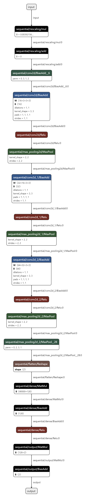

This is a small project to learn more about Tensorflow and ONNX.

There are two main projects here, inside the **model** folder there is Tensorflow model created to classify images. 


## model

This is where everyhing starts. Here you will find a Python program to define, train and export a Tensorflow model.
The model will be exported an ONNX.

This model will classify images from different classes. In order to train the model you must create a folder like the dataset, where each subdirectory is a class. Inside this subdirectory add the images of the class.

Then execute the following command from this repo root folder:

```
python model/main.py 
    --dataset-dir=<dir> 
    --image-width=<width> 
    --image-height=<height> 
    --image-channels=<channels> 
    --batch-size=<batch> 
    --epochs=<epochs>
```

The parameters are:
1. **--dataset-dir**: the directory where the images organized by class are located.
2. **--image-width**: the directory where the images organized by class are located.
3. **--image-height**: the directory where the images organized by class are located.
4. **--image-channels**: the directory where the images organized by class are located.
5. **--batch-size**: the directory where the images organized by class are located.
1. **--epochs**: the directory where the images organized by class are located.

#### Notes

The model will resize every image. The size of this region is defined by the width and height. The larger the region, the bigger the model will, more time will take to train, and more memory it will need.

The number of channels define if th

The epochs parameters 

Below you can view the model defined. This is a sample model I took from the Tensorflow docs. I am not trying to create a innovative model architecture here. :)



## inference

## onnx

ONNX is

## ONNX Runtime - GPU Execution Provider

To use NVIDIA GPU during the inference for C# applications we need the **Microsoft.ML.OnnxRuntime.Gpu** package.

This package will require the following packages from NVIDIA. I downloaded them from [here](https://developer.download.nvidia.com/compute/cuda/redist/) and [here](https://developer.nvidia.com/rdp/cudnn-download). I am also providing the links below for the versions I have used.

1. [libcublas-windows-x86_64-11.11.3.6-archive.zip](https://developer.download.nvidia.com/compute/cuda/redist/libcublas/windows-x86_64/libcublas-windows-x86_64-11.11.3.6-archive.zip)
2. [libcufft-windows-x86_64-10.9.0.58-archive.zip](https://developer.download.nvidia.com/compute/cuda/redist/libcufft/windows-x86_64/libcufft-windows-x86_64-10.9.0.58-archive.zip)
3. [cudnn-windows-x86_64-8.9.5.29_cuda11-archive](https://developer.nvidia.com/downloads/compute/cudnn/secure/8.9.5/local_installers/11.x/cudnn-windows-x86_64-8.9.5.29_cuda11-archive.zip/)
4. [cuda_cudart-windows-x86_64-11.8.89-archive.zip](https://developer.download.nvidia.com/compute/cuda/redist/cuda_cudart/windows-x86_64/cuda_cudart-windows-x86_64-11.8.89-archive.zip)

## ONNX Runtime - OpenVINO Execution Provider

To use OpenVINO in ONNX C# runtime we need to install the following packages. They are not available on Nuget.

1. [Microsoft.ML.OnnxRuntime.Managed.1.15.0-dev-20230621-0632-69695172e.nupkg](https://github.com/intel/onnxruntime/releases/download/v5.0.0/Microsoft.ML.OnnxRuntime.Managed.1.15.0-dev-20230621-0632-69695172e.nupkg)
2. [Microsoft.ML.OnnxRuntime.OpenVino.1.15.0-dev-20230621-0632-69695172e.nupkg](https://github.com/intel/onnxruntime/releases/download/v5.0.0/Microsoft.ML.OnnxRuntime.OpenVino.1.15.0-dev-20230621-0632-69695172e.nupkg)
